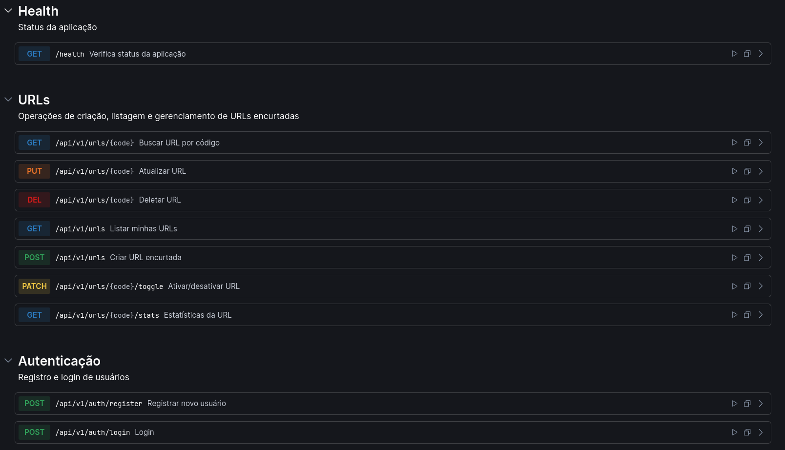
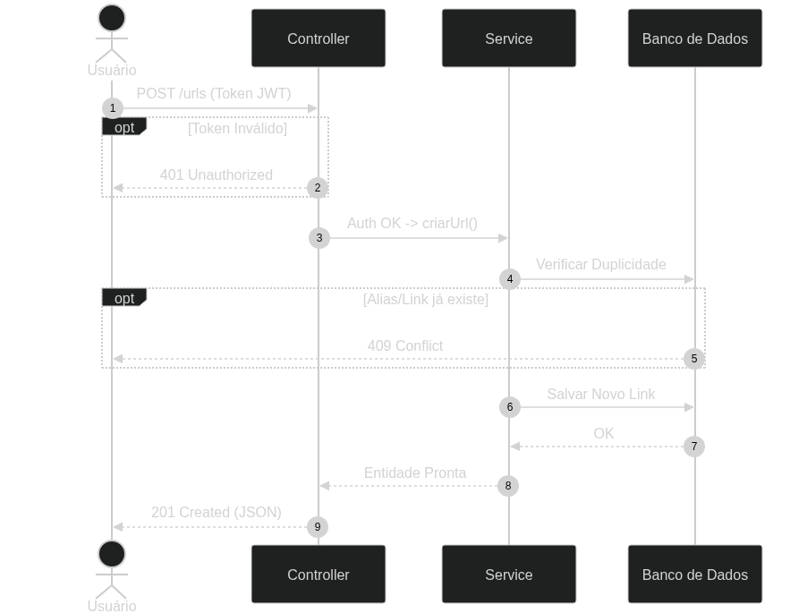
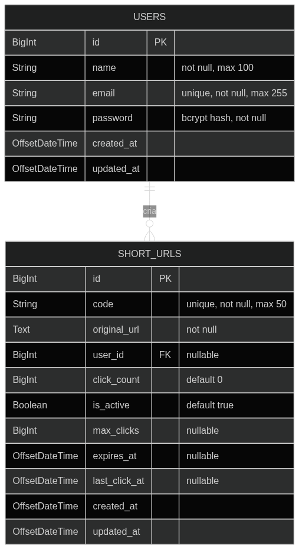

# FlyLink API

> **Encurtador de URLs focado em simplicidade, robustez e Clean Code.**

Desenvolvi este projeto utilizando **Java 21** e **Spring Boot 4**, com o objetivo de criar uma API RESTful para gerenciamento de links curtos, aplicando boas práticas de engenharia de software (SOLID, DRY) para entregar um código limpo e sustentável.

---

## 🏗 Arquitetura e Decisões de Design

Adotei uma arquitetura em camadas bem definidas, garantindo separação de responsabilidades.

```text
src/main/java/com/flylink
├── domain          # O "Coração" do sistema (Regras de Negócio)
├── infrastructure  # Detalhes de implementação (Banco de Dados, Configs)
└── web             # Camada de Entrada (Controllers, DTOs, Handlers)
```

### Destaques do Código
- **DTO Pattern**: Decidi não expor as entidades JPA (`ShortUrlEntity`) diretamente na API. Criei Records (`CreateUrlRequest`, `UrlResponse`) para garantir contratos seguros.
- **Tratamento Centralizado de Erros**: Implementei um `GlobalExceptionHandler` (`@ControllerAdvice`) para capturar exceções de negócio e retornar respostas JSON padronizadas, evitando `try-catch` espalhados pelo código.
- **Simplicidade (KISS)**: Para este MVP, optei por uma arquitetura síncrona. A contagem de cliques é feita na mesma transação, garantindo consistência imediata sem complexidade desnecessária neste momento.
- **Injeção de Dependência**: Usei injeção via construtor para facilitar testes futuros e garantir imutabilidade.

---

## 🧩 O Algoritmo de Encurtamento

Para gerar os códigos curtos (ex: `AbC123z`), implementei um algoritmo baseado em **Base62**.

### Como funciona?
Utilizo um alfabeto de 62 caracteres:
- `0-9` (10 números)
- `A-Z` (26 maiúsculas)
- `a-z` (26 minúsculas)
- **Total**: 10 + 26 + 26 = 62 caracteres.

### Por que 7 caracteres?
Com um comprimento fixo de 7 caracteres, o espaço de combinações possíveis é:
`62^7 = 3.521.614.606.208`
Isso gera mais de **3.5 trilhões** de combinações únicas. 

Para este MVP, utilizei uma estratégia de geração aleatória (`SecureRandom`) com verificação de colisão (`do-while`). Embora exista uma chance infinitesimal de colisão, ela é tratada verificando a existência no banco antes de salvar. Em um cenário de escala massiva (Twitter/Google), eu evoluiria para uma estratégia de **ID Pré-gerado (KGS - Key Generation Service)** ou conversão de base numérica a partir de um ID sequencial.

---

## 🛠 Stack Tecnológica & Infraestrutura

A escolha da stack foi baseada em estabilidade (LTS) e performance.

### 🐘 Banco de Dados: PostgreSQL 16
Utilizei a versão mais recente e estável (**PostgreSQL 16**) rodando sobre **Alpine Linux** para leveza.
- **Indexação**: Focada em otimização de leitura. O campo `code` (o link curto) possui um índice `UNIQUE` (B-Tree) para garantir buscas em tempo constante O(1) ou logarítmico, essencial para o redirecionamento rápido.
- **Persistência**: Dados persistidos em volume Docker (`postgres_data`) para segurança entre restarts.

### 🐳 Docker & Containerização
Todo o ambiente de desenvolvimento é orquestrado via **Docker Compose**:
- **Consistência**: Garante que o banco sobe exatamente com a mesma configuração em qualquer máquina (`postgres:16-alpine`).
- **Healthchecks**: Configurei healthchecks nativos (`pg_isready`) para garantir que a aplicação só tente conectar quando o banco estiver realmente pronto.
- **Isolamento**: O banco roda isolado na rede interna do Docker, expondo apenas a porta padrão 5432.

### Outras Tecnologias
- **Java 21 (LTS)**: Aproveitando performance da JVM moderna.
- **Spring Boot 4.0.2**: Versão de ponta do framework.
- **Flyway**: Preparado para versionamento de schema.
- **SpringDoc OpenAPI (Scalar UI)**: Documentação viva e interativa.

---

## 📜 Documentação Interativa (Swagger / Scalar)

A API é 100% documentada seguindo a especificação **OpenAPI 3.1**. Você pode testar todos os endpoints (Criar, Listar, Estatísticas) diretamente pelo navegador através de uma interface visual amigável.



> Acesse após rodar o projeto: [http://localhost:8080/swagger-ui.html](http://localhost:8080/swagger-ui.html)

---

## 📊 Diagramas

### Fluxo da Aplicação


### Modelagem do Banco de Dados


---

## 🚀 Como Executar

O projeto foi desenhado para ser "Plug & Play" graças ao Docker.

### Pré-requisitos
- Java 21 (JDK) Instalado
- Docker & Docker Compose Instalados

### Passo a Passo

1. **Subir a Infraestrutura**:
   ```bash
   docker-compose up -d
   ```
   *Isso baixará a imagem do Postgres 16 Alpine e iniciará o container.*

3. **Rodar a Aplicação**:
   ```bash
   ./mvnw spring-boot:run
   ```
   *O Maven baixará automaticamente o Spring Boot e todas as dependências necessárias.*

3. **Testar via Swagger**:
   Acesse a documentação interativa para testar os endpoints sem precisar instalar nada.

---

## 🔮 Próximos Passos (Roadmap)

Planejo evoluir este projeto para lidar com alta escala e adicionar novas funcionalidades:

- [ ] **Testes Automatizados**: Criar testes unitários e de integração (ainda não implementados).
- [ ] **Cache com Redis**: Para otimizar a leitura e redirecionamento de URLs muito acessadas.
- [ ] **Microsserviço de Notificação**: Criar uma API separada (com RabbitMQ/Kafka) para enviar e-mails quando um link atingir metas de cliques (ex: 1000 acessos).
- [ ] **Segurança**: Implementar autenticação JWT com Spring Security.

---

## 👨‍💻 Autor

Desenvolvido por **Gabriel Pereira** - [LinkedIn](https://linkedin.com/in/gabrielpereiraplus) | [GitHub](https://github.com/gabrielsilvaplus)
