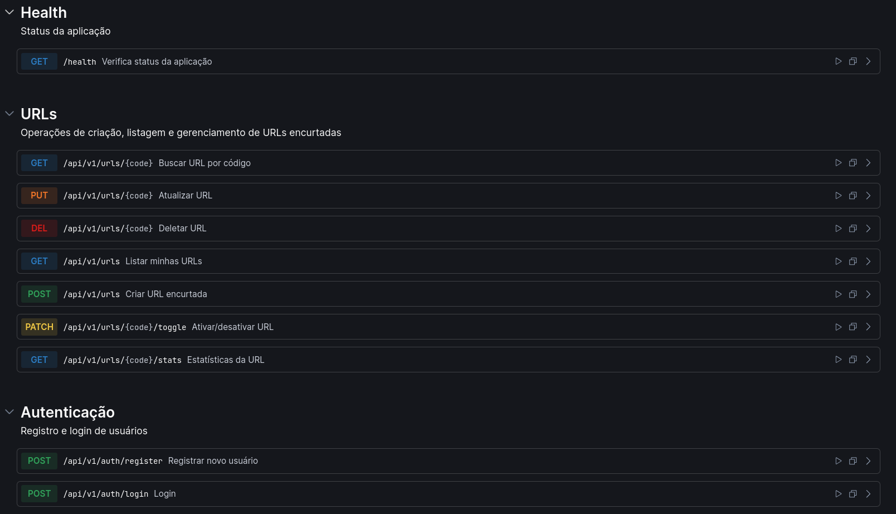
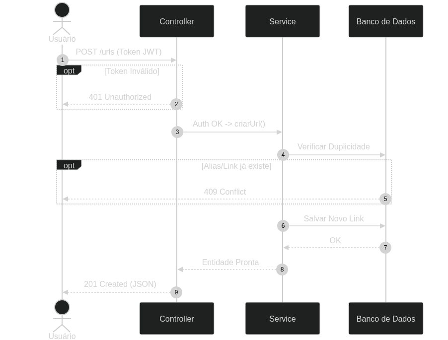
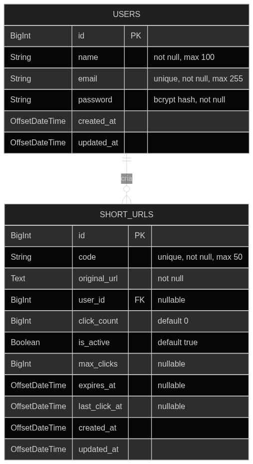

# FlyLink API

> **Encurtador de URLs focado em simplicidade, robustez e Clean Code.**

Desenvolvi este projeto utilizando **Java 21** e **Spring Boot 4**, com o objetivo de criar uma API RESTful para gerenciamento de links curtos, aplicando boas práticas de engenharia de software (SOLID, DRY) para entregar um código limpo e sustentável.

---

## 🏗 Arquitetura e Decisões de Design

Adotei uma arquitetura em camadas bem definidas, garantindo separação de responsabilidades.

```text
src/main/java/com/flylink
├── config          # Configurações Globais (Security, CORS, JWT, OpenAPI)
├── domain          # O "Coração" do sistema (Regras de Negócio e Serviços)
├── infrastructure  # Detalhes de implementação (JPA, Repositórios, Provider JWT)
└── web             # Camada de Entrada (Controllers, DTOs, ExceptionHandlers)
```

### Destaques do Código
- **DTO Pattern**: Decidi não expor as entidades JPA (`ShortUrlEntity`) diretamente na API. Criei Records (`CreateUrlRequest`, `UrlResponse`) para garantir contratos seguros.
- **Tratamento Centralizado de Erros**: Implementei um `GlobalExceptionHandler` (`@ControllerAdvice`) para capturar exceções de negócio e retornar respostas JSON padronizadas, evitando `try-catch` espalhados pelo código.
- **Simplicidade (KISS)**: Para este MVP, optei por uma arquitetura síncrona. A contagem de cliques é feita na mesma transação, garantindo consistência imediata sem complexidade desnecessária neste momento.
- **Injeção de Dependência**: Usei injeção via construtor para facilitar testes futuros e garantir imutabilidade.

---

## 🛡️ Segurança e Autenticação (JWT)

Para proteger a criação e gerenciamento dos links, implementei um sistema de autenticação robusto e *Stateless*:
- **Filtro Customizado (`OncePerRequestFilter`)**: Intercepta as requisições, valida a assinatura do token JWT emitido e injeta o usuário no contexto do Spring Security de forma performática.
- **BCrypt Hashing**: Senhas de usuários nunca são salvas em texto plano; o banco armazena apenas o hash BCrypt para proteção contra vazamentos.
- **Camada de Exceções de Segurança**: Respostas claras de `HTTP 401 Unauthorized` e `HTTP 403 Forbidden` gerenciadas nativamente pelos *EntryPoints* e *Handlers* do Security.

---

## 🧩 O Algoritmo de Encurtamento

Para gerar os códigos curtos (ex: `AbC123z`), implementei um algoritmo baseado em **Base62**.

### Como funciona?
Utilizo um alfabeto de 62 caracteres:
- `0-9` (10 números)
- `A-Z` (26 maiúsculas)
- `a-z` (26 minúsculas)
- **Total**: 10 + 26 + 26 = 62 caracteres.

### Por que 7 caracteres?
Com um comprimento fixo de 7 caracteres, o espaço de combinações possíveis é:
`62^7 = 3.521.614.606.208`
Isso gera mais de **3.5 trilhões** de combinações únicas. 

Para este MVP, utilizei uma estratégia de geração aleatória (`SecureRandom`) com verificação de colisão (`do-while`). Embora exista uma chance infinitesimal de colisão, ela é tratada verificando a existência no banco antes de salvar. Em um cenário de escala massiva (Twitter/Google), eu evoluiria para uma estratégia de **ID Pré-gerado (KGS - Key Generation Service)** ou conversão de base numérica a partir de um ID sequencial.

---

## ⏳ Links Dinâmicos (Self-Destruct)

A API FlyLink suporta links efêmeros, perfeitos para campanhas de marketing com escassez ou compartilhamento seguro de informações temporárias.

### Como funciona:
- **Por Tempo (`expiresAt`)**: Você pode definir uma data e hora no futuro. Passado esse momento, o link expirará automaticamente. Trata problemas complexos de *Timezone* armazenando em `OffsetDateTime` (UTC).
- **Por Cliques (`maxClicks`)**: Você pode limitar um link aos "10 primeiros acessos", por exemplo. O banco de dados garante atomicamente (`UPDATE SET ... CASE WHEN`) que exatamente 10 pessoas terão acesso antes do link se autodestruir, evitando *Race Conditions*.

Quando um usuário tenta acessar um link que se autodestruiu, a API retorna impecavelmente o código semântico **HTTP 410 Gone**, informando aos clientes (finais e frontends baseados em React Query/Orval) que o recurso existia, mas expirou intencionalmente.

---

## 🧪 Qualidade de Software e Testes

Como um projeto projetado para o mercado, a qualidade e resiliência foram prioridade. A API conta com uma **suíte de testes de amplo espectro** (Unitários e de Integração), todos padronizados e documentados em Português-BR.

- **Padrão AAA (Arrange, Act, Assert)**: Todos os testes seguem uma estrutura lógica estrita para máxima legibilidade. Nossos arquivos de teste **não possuem "God Methods"**; garantimos extrema granularidade (um teste por comportamento).
- **Testes Unitários de Alta Performance**: Os componentes de domínio e web (`Services` e `Controllers`) são testados injetando dependências isoladas via **Mockito**, permitindo execução local de centenas de testes em centésimos de segundo.
- **Testes de Integração com Testcontainers**: A camada de persistência e fluxos End-to-End (E2E) não utilizam banco de dados em memória falso (como H2). Eles levantam um container com uma imagem oficial do **PostgreSQL 16** via `Testcontainers`, realizando testes contra o motor real do banco para prevenir surpresas em produção.

## 🛠 Stack Tecnológica & Infraestrutura

A escolha da stack foi baseada em estabilidade (LTS) e performance.

### 🐘 Banco de Dados: PostgreSQL 16
Utilizei a versão mais recente e estável (**PostgreSQL 16**) rodando sobre **Alpine Linux** para leveza.
- **Indexação**: Focada em otimização de leitura. O campo `code` (o link curto) possui um índice `UNIQUE` (B-Tree) para garantir buscas em tempo constante O(1) ou logarítmico, essencial para o redirecionamento rápido.
- **Persistência**: Dados persistidos em volume Docker (`postgres_data`) para segurança entre restarts.

### 🐳 Docker & Containerização (Fundação para Cloud)
Preparei apenas a base essencial para uma futura migração para a Nuvem (AWS).
- **Orquestração Local**: O ambiente de desenvolvimento isolado levanta o PostgreSQL via `docker-compose.yml` utilizando healthchecks e redes internas.
- **Dockerfile Multi-Stage**: Para quando for a hora de subir para produção (EC2, App Runner, etc), incluí um `Dockerfile` otimizado e um `.dockerignore` que geram uma imagem minúscula baseada em **JRE Alpine** sob um usuário não-root.

### Outras Tecnologias
- **Java 21 (LTS)**: Aproveitando performance da JVM moderna.
- **Spring Boot 4.0.2**: Versão de ponta do framework.
- **Flyway**: Preparado para versionamento de schema.
- **SpringDoc OpenAPI (Scalar UI)**: Documentação viva e interativa.

---

## 📜 Documentação Interativa (Swagger / Scalar)

A API é 100% documentada seguindo a especificação **OpenAPI 3.1**. Você pode testar todos os endpoints (Criar, Listar, Estatísticas) diretamente pelo navegador através de uma interface visual amigável.



> Acesse após rodar o projeto: [http://localhost:8080/swagger-ui.html](http://localhost:8080/swagger-ui.html)

---

## 📊 Diagramas

### Fluxo da Aplicação


### Modelagem do Banco de Dados


---

## 🚀 Como Executar

O projeto foi desenhado para ser "Plug & Play" graças ao Docker.

### Pré-requisitos
- Java 21 (JDK) Instalado
- Docker & Docker Compose Instalados

### Passo a Passo

1. **Subir a Infraestrutura**:
   ```bash
   docker-compose up -d
   ```
   *Isso baixará a imagem do Postgres 16 Alpine e iniciará o container.*

3. **Rodar a Aplicação**:
   ```bash
   ./mvnw spring-boot:run
   ```
   *O Maven baixará automaticamente o Spring Boot e todas as dependências necessárias.*

3. **Testar via Swagger**:
   Acesse a documentação interativa para testar os endpoints sem precisar instalar nada.

---

## 🔮 Próximos Passos (Roadmap)

Com as bases do backend consolidadas, o projeto agora pivotará para o ecossistema Frontend.

- [x] **Segurança**: Implementar autenticação JWT com Spring Security e BCrypt.
- [x] **Testes Automatizados**: Criar cobertura extensa de testes Unitários (Mockito) e de Integração realística (Testcontainers).
- [ ] **Desenvolvimento Frontend (Foco Atual)**: Criação de uma SPA de alta performance utilizando **React + Vite** e gerenciador de pacotes **Bun**. Consumo da API tipado de ponta a ponta com **Orval JS** + **TanStack Query**, roteamento com **TanStack Router**, estilização via **Tailwind CSS** e validações estruturais com **Zod**.
- [ ] **Integração na AWS (Futuro)**: Subir a infraestrutura preparada no Docker para os serviços gerenciados da nuvem.
- [ ] **Cache de Leitura (Redis)**: Para otimizar a latência no redirecionamento de URLs virais (muito acessadas).

---

## 👨‍💻 Autor

Desenvolvido por **Gabriel Pereira** - [LinkedIn](https://linkedin.com/in/gabrielpereiraplus) | [GitHub](https://github.com/gabrielsilvaplus)
